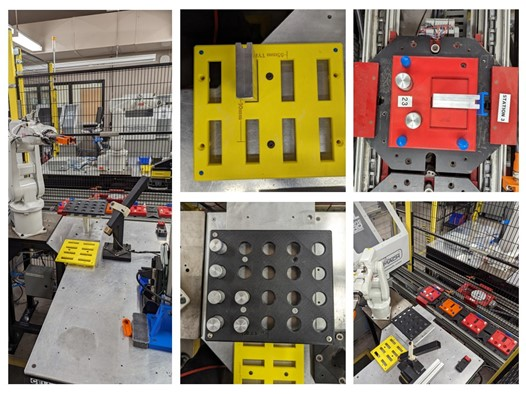

# Automation Sequence
This report contains the information and pictures of the task for loading and unloading round bars and flat bars from fixtures into the pallet. We have gathered and placed the pictures of the coordinate systems of 3 work objects from RobotStudio software. We have also included the robot path from different angles. After loading the code from RobotStudio to the physical robot station, we have trained the points and workobjects according to the station and we are sharing a few pictures taken during the setup and experiment process.

## Description

The objective of this lab was divided into 3 parts as follows:
* Setting up and testing interlocks used to communicate between Robot and PLC to release the pallet or sense the presence of the pallet.
* Writing and testing the code to load and unload round bars or flat bars from their fixtures to or from the pallet. The robot should run in the Auto mode for loading/unloading 2 round bars and 1 flat bar depending on the task selected from the menu.
* Adding the nested menu for manual operation. Allowing the user to enter a specific position from which the round bar or flat bar is to be picked or placed.

Here is the Robot setup in the RobotStudio and the physical station.

  
  

This picture shows the placement of the workobject with the names used in the code.

  

This picture is to visualize the path of the robot.

  

The following picture shows the robotic arm in action. The complete demonstration video is uploaded on YouTube. 

  

Complete video demonstration can be found here.
[https://www.youtube.com/watch?v=e7sxpr8Y60U]

### Dependencies

* Software: Robotstudio 2022
* Robot: ABB IRB 120

### Executing program

* Load the program in the FlexPendent
* Set up the work objects
* Run the program

## Authors

Contributors names and contact info

Harsh Bhatt [@harshbhatt99],
Hardik Patel,
Sepehr Sheikhipour,

## Acknowledgments

Niagara College Canada
